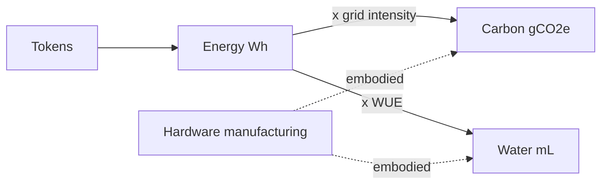

# Research: Measuring the Carbon Footprint of Session-Based AI Usage

_Compiled 2026-07-27. Wide survey of primary sources (peer-reviewed papers, first-party provider disclosures, open measurement tools) on estimating the energy, carbon, and water footprint of API-based LLM usage — with an eye toward adding per-session carbon estimates to this tracker._

---

## 1. The core method

Every credible approach reduces to one formula, canonized by Lacoste et al. (2019) and standardized as the **Software Carbon Intensity (SCI) spec, ISO/IEC 21031:2024** (Green Software Foundation):

> **CO₂e per session = (Energy × PUE × Grid carbon intensity) + amortized embodied hardware emissions**

SCI formula, exact (from `Green-Software-Foundation/sci` SPEC.md v1.1.0):

```
SCI = (O + M) per R
  O = E × I          # operational: energy (kWh) × grid intensity (gCO2e/kWh)
  M = (TE/EL) × (TR/TR_total)   # embodied hardware carbon, amortized
  R = functional unit (per query, per session, per 1K tokens)
```

Key points:

- **Energy (E):** what the servers drew to serve your tokens. You can't meter a provider's datacenter, so you estimate from _output tokens × energy-per-token_, calibrated on measured benchmarks of open models of similar size. LLM decoding is **memory-bandwidth-bound**, so GPUs run well below rated power (~25% of TDP in the BLOOM study) — naive TDP math overestimates.
- **PUE (Power Usage Effectiveness):** datacenter overhead multiplier (cooling, power conversion). Hyperscalers ≈ 1.09–1.20; industry average ≈ 1.58 (Patterson 2022).
- **Grid carbon intensity:** gCO₂e/kWh where the datacenter sits. US ≈ 384–386, world ≈ 458–475, France ≈ 82.
- **Embodied emissions:** manufacturing carbon of hardware, amortized over ~3-year life (~273 kgCO₂e per H100). Typically 20–35% of lifecycle totals (BLOOM: 22%; LLMCarbon: 24–35%; Google 2025: 33%).
- SCI mandates **location-based** intensity — renewable energy credits/offsets do _not_ reduce an SCI score; only efficiency does.

## 2. Energy vs. carbon vs. water — three distinct metrics

Energy is the _physical input_; carbon and water are _consequences_ of producing/using that energy.

| Metric     | Unit        | Derivation                               | Key property                                                                                                                 |
| ---------- | ----------- | ---------------------------------------- | ---------------------------------------------------------------------------------------------------------------------------- |
| **Energy** | Wh/query    | Estimated directly from tokens           | Objective, location-independent; the fundamental unit                                                                        |
| **Carbon** | gCO₂e/query | energy × grid intensity (+ embodied)     | Location- and accounting-dependent (France vs. US ≈ 5×; market- vs. location-based ≈ 3.7×)                                   |
| **Water**  | mL/query    | energy × WUE (+ scope-2 + manufacturing) | Most boundary-sensitive (170× spread across published figures); locally meaningful (water stress is regional, CO₂ is global) |



Water has two channels: **on-site cooling** (evaporative cooling, ~1.15 L/kWh consumed at Google) and **upstream** water used by power plants (~3–4 L/kWh US average; Li et al. 2023). Google reports 0.26 mL/prompt (on-site only) vs. Mistral's 45 mL (full lifecycle) — 170× apart, both "correct" for their stated boundary.

**Guidance:** estimate energy first; carbon and water are multipliers with stated assumptions. Energy is the most defensible number; carbon the most communicable; water only worth reporting with an explicit, fixed boundary.

## 3. Primary sources: per-query numbers

| Source                              | Model / setup                       | Energy/query                 | Carbon/query                  | Scope                                                                | Method                                   |
| ----------------------------------- | ----------------------------------- | ---------------------------- | ----------------------------- | -------------------------------------------------------------------- | ---------------------------------------- |
| de Vries, _Joule_ 2023              | GPT-3.5, A100                       | **~3 Wh**                    | ~1.3 gCO₂e                    | GPU max TDP only                                                     | Estimated (SemiAnalysis model)           |
| Luccioni et al. 2022 (BLOOM)        | BLOOM-176B, 16×A100                 | **~4 Wh**                    | ~1.5 gCO₂e                    | GPU+CPU+RAM, no PUE                                                  | Measured, unbatched                      |
| Samsi et al., IEEE HPEC 2023        | LLaMA-65B, A100                     | **~0.3 Wh**                  | —                             | GPU only                                                             | Measured, unbatched                      |
| Epoch AI, Feb 2025                  | GPT-4o (~100B active), H100         | **~0.3 Wh** (500 tokens)     | —                             | GPU+server+utilization+PUE                                           | FLOPs-based estimate, open spreadsheet   |
| Sam Altman blog, Jun 2025           | ChatGPT (unspecified)               | **0.34 Wh** (+0.32 mL water) | —                             | **Unknown — no methodology disclosed**                               | Self-disclosed                           |
| Google, Aug 2025 (arXiv:2508.15734) | Gemini Apps, TPU, May 2025          | **0.24 Wh**                  | **0.03 gCO₂e**, 0.26 mL water | Full stack: accelerator+CPU+DRAM+idle+PUE, market-based, Scope 1+2+3 | Measured production fleet                |
| Mistral LCA, Jul 2025               | Mistral Large 2, 400-token response | —                            | **1.14 gCO₂e**, 45 mL water   | Full ISO LCA: embodied + operational, location-based                 | Peer-reviewed LCA (with ADEME/Carbone 4) |

Per-token translations:

- Epoch AI / Samsi: ~0.3 Wh per 500 tokens → **~0.0006 Wh/token**
- Mistral LCA: **0.00285 gCO₂e/token** (full lifecycle)
- Google Gemini: ~0.00003 gCO₂e/token (~95× lower than Mistral — boundary choice + clean-energy procurement, not measurement error)

### Source details

**Luccioni, Jernite & Strubell — "Power Hungry Processing: Watts Driving the Cost of AI Deployment?" (FAccT 2024).** DOI 10.1145/3630106.3658542; arXiv:2311.16863. Measured 88 models × 10 tasks with CodeCarbon on real GPUs. Text generation ≈ 0.04–0.05 kWh per 1,000 inferences; image generation up to 2.9 kWh per 1,000 (SDXL: 1,594 gCO₂e per 1,000 images ≈ 4.1 miles of driving); 1,450× spread between cheapest and most expensive task. Multi-purpose generative models are orders of magnitude costlier than task-specific ones at the same parameter count. GPU-only, unbatched — underestimates overhead, overestimates per-token vs. production batching.

**Luccioni, Viguier & Ligozat — "Estimating the Carbon Footprint of BLOOM, a 176B Parameter Language Model" (2022).** arXiv:2211.02001. End-to-end LCA: training = 433 MWh, 50.5 tCO₂e total (22% embodied, 49% dynamic, 29% idle) on a French nuclear grid (57 gCO₂e/kWh). Real 18-day API deployment: 914 kWh over 230,768 requests ≈ **4 Wh / 1.5 gCO₂e per request**, unbatched — ~75% of energy went to just keeping the model resident in memory. GPUs drew only ~104 W of 400 W TDP (~26%). Also shows grid choice dominates: BLOOM vs. GPT-3 training carbon (25 t vs. 502 t) is almost entirely the 57-vs-429 gCO₂e/kWh grid difference.

**Patterson et al. — "Carbon Emissions and Large Neural Network Training" (2021, arXiv:2104.10350) and "The Carbon Footprint of ML Training Will Plateau, Then Shrink" (2022, arXiv:2204.05149).** GPT-3 training ≈ 1,287 MWh / 552 tCO₂e. Sparse MoE models use <1/10 the energy of dense models at equal parameter count. The "4Ms" (Model, Machine, Mechanization, Map) can cut energy 100× and CO₂ 1,000×. Verbatim: "about 3% of [Google's] energy use is for inference and 7% for training" → within ML, **~30% inference / 70% training** at Google. ⚠️ The widely-repeated "60% of ML energy is inference (Patterson 2022)" claim (cited in Luccioni FAccT 2024) appears to be a **misquotation** — it is not in the paper.

**Wu et al. (Meta) — "Sustainable AI: Environmental Implications, Challenges and Opportunities" (MLSys 2022).** arXiv:2111.00364. Meta infrastructure capacity: 70% inference / 20% training / 10% experimentation. For their translation LM: inference = 65% of energy. Embodied carbon ≈ 50% of location-based operational carbon; at ~97% renewables, embodied dominates (80–95% of total). PUE ≈ 1.10.

**de Vries — "The growing energy footprint of artificial intelligence" (_Joule_ 7(10), Oct 2023).** DOI 10.1016/j.joule.2023.09.004. The famous **~3 Wh/query** figure (range 2–10 Wh), from a SemiAnalysis model: GPT-3.5 dense 175B, A100 at 800 W peak, 2,000 output tokens assumed. Now considered ~10× too high for modern serving: ~4× from token-count assumption (real chats average 261–500 output tokens), ~2× hardware (A100→H100), rest from MoE and utilization accounting. Still useful as a historical upper bound.

**Epoch AI — "How much energy does ChatGPT use?" (Gradient Updates, Feb 2025).** epoch.ai/gradient-updates/how-much-energy-does-chatgpt-use. Central estimate **~0.3 Wh per GPT-4o query** (500 output tokens). Derivation: ~100B active params (MoE) × 2 FLOPs/param/token × 500 tokens = 1e14 FLOP; H100 at 989 TFLOP/s peak, **10% utilization** (inferred from open-model API pricing), ~1,500 W/GPU including server+DC overhead, 70% average power fraction → ≈ 0.3 Wh. Long contexts are the exception: 10k-token input ≈ 2.4 Wh, 100k ≈ 40 Wh (one-time per conversation thanks to KV cache). Reasoning models likely 2–3× higher. Fully open assumptions spreadsheet.

**Sam Altman — "The Gentle Singularity" (blog, Jun 2025).** blog.samaltman.com/the-gentle-singularity. "The average query uses about 0.34 watt-hours… about 0.000085 gallons of water; roughly one fifteenth of a teaspoon." **No methodology or boundary disclosed** (Google's paper explicitly flags this); numerically consistent with Epoch AI, but unverifiable and from an interested party.

**Mistral AI — lifecycle analysis of Mistral Large 2 (Jul 2025, with Carbone 4 and ADEME).** mistral.ai/news/our-contribution-to-a-global-environmental-standard-for-ai. **First peer-reviewed, ISO-compliant LCA of an LLM.** Marginal impact of one 400-token Le Chat response: **1.14 gCO₂e, 45 mL water, 0.16 mg Sb eq**. Training + 18 months of usage: 20.4 ktCO₂e, 281,000 m³ water. Found footprint scales ~linearly with model size. Includes hardware manufacturing and upstream (scope-2) water — hence the large water figure vs. Google's.

**Elsworth, Patterson, Dean, et al. (Google) — "Measuring the environmental impact of delivering AI at Google scale" (Aug 2025).** arXiv:2508.15734. **The only first-party at-scale production measurement.** Median Gemini Apps text prompt (May 2025): **0.24 Wh, 0.03 gCO₂e (market-based), 0.26 mL water**. Energy breakdown: 58% accelerators, 25% CPU+DRAM, 10% idle reserved capacity, 8% PUE. Narrow GPU-only accounting would give 0.10 Wh — **2.4× less for the same system**. 33× energy / 44× carbon reduction per prompt in 12 months (MoE + Flash models, utilization, cleaner energy). Market-based factor 94 gCO₂e/kWh vs. location-based 345 (3.7×). Excludes training, networking, end-user devices. Median hides the long tail. Their Figure 2: published Llama-3.1-70B estimates span ~580–3,600 prompts/kWh purely from framework/boundary choices.

**Faiz et al. — "LLMCarbon: Modeling the End-to-End Carbon Footprint of Large Language Models" (ICLR 2024).** arXiv:2309.14393. FLOPs-based model: inference FLOPs ≈ 2 × params × tokens (training ≈ 6PD). Validated within ±8.2% of Google's published figures. Embodied = 24–35% of lifecycle carbon (92–95% under near-100% renewables). H100 cuts operational carbon 71% vs. V100.

**Samsi et al. — "From Words to Watts: Benchmarking the Energy Costs of Large Language Model Inference" (IEEE HPEC 2023).** DOI 10.1109/HPEC58863.2023.10363447; arXiv:2310.03003. MIT Lincoln Lab. Measured LLaMA 7B/13B/65B on V100/A100: **LLaMA-65B ≈ 0.3 Wh/response**; per-token energy ~linear in parameter count. Unbatched, GPU-only.

**Chung, Chowdhury et al. (U. Michigan) — Zeus (NSDI 2023) and "The ML.ENERGY Benchmark" (NeurIPS 2025 D&B, Spotlight).** arXiv:2505.06371; ml.energy/leaderboard. **The best open dataset of measured Wh/output-token** — dozens of open LLMs on H100s under production-style vLLM batching. Follow-up "Where Do the Joules Go?" (arXiv:2601.22076): decode is memory-bound (power well below TDP; diffusion models by contrast run at ~TDP); task type alone can cause 25× energy differences; INT8 isn't always cheaper; more GPUs can _reduce_ total energy via KV-cache headroom.

**Li, Yang, Islam & Ren — "Making AI Less 'Thirsty'" (2023).** arXiv:2304.03271. Water accounting framework: scope-1 (on-site evaporative cooling, ~1.0–1.2 L/kWh) + scope-2 (power generation, ~3–4 L/kWh US consumption). GPT-3.5 ≈ 10–50 mL per medium response. Projects 4.2–6.6 billion m³ global AI water withdrawal by 2027.

## 4. Key disagreements (and why they're mostly boundary choices)

1. **3 Wh vs. 0.3 Wh per query (10×):** de Vries 2023 vs. Epoch/Google/Altman 2025. Explained by token-count assumptions (~4×), A100→H100 (~2×), dense→MoE, and peak-vs-average power. Newer figures are better grounded.
2. **GPU-only vs. full-stack (2.4×):** Google's own system measures 0.10 Wh narrow vs. 0.24 Wh comprehensive.
3. **Market- vs. location-based carbon (3.7× at Google):** renewable-credit accounting vs. physical grid. SCI/ISO 21031 mandates location-based.
4. **Water: 0.26 mL vs. 10–50 mL vs. 45 mL:** on-site-cooling-only (Google) vs. scope-1+2 (Li et al.) vs. full LCA incl. manufacturing (Mistral). Not contradictory — different scopes.
5. **Training/inference split:** Google ~70/30 training-heavy; Meta inference-dominant; AWS claimed 80–90% inference (Barr 2019). No consensus; the "60% inference (Patterson)" meme is unsupported.
6. **Embodied carbon:** excluded by most GPU-energy papers; 22–35% of lifecycle where measured; dominant under clean grids.

## 5. Practical tools for token-based estimation (closed models)

### EcoLogits — the purpose-built tool ⭐

- **Repo:** `mlco2/ecologits` · docs: ecologits.ai · MPL-2.0 (code), CC BY-SA 4.0 (methodology) · Zenodo DOI 10.5281/zenodo.15601289 · actively maintained (CodeCarbon nonprofit).
- **Inputs:** provider + model name + **output token count** + request latency; optional grid zone (ISO alpha-3). Exactly what this tracker's Derived Store already has.
- **Method:** bottom-up LCA. GPU energy per output token from a regression **fitted on ML.ENERGY's measured H100 data**: `E_gpu(Wh/token) = α·e^(β·B)·P_active + γ` with α=1.17e-6, β=−0.0112, γ=4.05e-5, default batch B=64. Adds server non-GPU power (1.2 kW/8-GPU node), GPU count from model memory footprint, PUE, grid intensity, and embodied hardware amortized over 3 years (H100: 273 kgCO₂e; server: 5,700 kgCO₂e via BoaviztAPI).
- **Outputs:** energy (kWh), GWP (kgCO₂e) with **min/mean/max uncertainty**, water (L), abiotic depletion, primary energy.
- **Closed-model proxies** (documented in `ecologits/data/models.json` + methodology pages), three methods: leaked architecture data (GPT-4 ≈ 1.76T MoE, 176–528B active), benchmark parity (Claude Opus ≈ GPT-4 scale), pricing inference (GPT-4-Turbo ≈ half-size distill). Unknown MoE activation ratio assumed 10–30% → min/max bounds. E.g. Claude Sonnet 4 ≈ 440B total / 44–132B active; GPT-4.1 ≈ 352B MoE / 35–106B active.
- Standalone post-hoc use (no SDK patching): replicate `llm_impacts(provider, model, output_tokens, latency, zone)` from `ecologits/impacts/llm.py` + the provider PUE table (`tracers/utils.py`) + `data/electricity_mixes.json`.

### Other tools surveyed

- **CodeCarbon** (`mlco2/codecarbon`, MIT): measures **local** CPU/GPU/RAM via RAPL/NVML × grid intensity. Cannot see remote API servers — its README explicitly points to EcoLogits for that. Relevant only for local inference (Ollama etc.). World fallback: 475 gCO₂e/kWh (IEA 2019).
- **ML CO2 Impact calculator** (Lacoste et al. 2019, arXiv:1910.09700; mlco2.github.io/impact): the canonical `hours × TDP × PUE × grid` formula; designed for training runs; passively maintained. The building block everything else extends.
- **Green Algorithms** (Lannelongue et al., _Advanced Science_ 2021, DOI 10.1002/advs.202100707; green-algorithms.org): general HPC compute calculator (cores × TDP × memory × PUE × intensity); no token/LLM modeling.
- **Zeus / ML.ENERGY** (Apache-2.0): GPU energy measurement library + the leaderboard dataset EcoLogits is calibrated on. Needs direct GPU access.
- **Cloud provider tools:** AWS Customer Carbon Footprint Tool, Google Cloud Carbon Footprint (per-region gCO₂e/kWh CSVs at `GoogleCloudPlatform/region-carbon-info` — useful lookup), Azure Carbon Optimization. All monthly/aggregate; none give per-request granularity.
- **Grid intensity data (free):** EPA eGRID (US, annual, by subregion; 2022 US avg ≈ 386 gCO₂e/kWh), Ember / Our World in Data (annual per-country, CC BY 4.0), Electricity Maps (real-time, paid API), WattTime (marginal emissions, registration). Simplest: vendor EcoLogits' `electricity_mixes.json` (200+ countries, USA = 0.3844, WOR = 0.45829 kgCO₂e/kWh).
- **HF AI Energy Score** (huggingface.co/spaces/AIEnergyScore/Leaderboard): standardized energy ratings for open models, methodology from the FAccT 2024 paper.

### Key default coefficients

| Coefficient              | Value                                            | Source                                    |
| ------------------------ | ------------------------------------------------ | ----------------------------------------- |
| World avg grid intensity | 0.458 kgCO₂e/kWh                                 | EcoLogits WOR (Our World in Data / Ember) |
| USA grid intensity       | 0.384 kgCO₂e/kWh                                 | EcoLogits USA; eGRID 2022 ≈ 0.386         |
| OpenAI PUE               | 1.20                                             | EcoLogits (Azure DCs)                     |
| Anthropic PUE            | 1.09–1.14                                        | EcoLogits (AWS/GCP mix)                   |
| Industry avg PUE         | 1.58                                             | Uptime Institute via Patterson 2022       |
| GPU energy α / β / γ     | 1.17e-6 Wh/tok/Bparam / −0.0112 / 4.05e-5 Wh/tok | EcoLogits fit on ML.ENERGY H100 data      |
| H100 embodied carbon     | 273 kgCO₂e                                       | ADEME (Lees-Perasso et al.)               |
| 8-GPU server embodied    | 5,700 kgCO₂e                                     | BoaviztAPI                                |
| Hardware lifetime        | 3 years                                          | EcoLogits                                 |
| Google WUE               | 1.15 L/kWh consumed                              | Google 2025 paper                         |

## 6. Application to this tracker

- The Derived Store already holds per-session **model + output tokens** — the exact inputs EcoLogits needs. Adding `gCO2e_min/mean/max` (and optionally `energy_wh`, `water_ml`) per session is a small extension: three regression constants + two JSON lookup tables, or `pip install ecologits` used offline.
- **Ballpark:** a coding session emitting ~1,000 output tokens on a GPT-4-class model ≈ **5–11 gCO₂e** (≈ 25–50 m of car driving). Sessions on Haiku/mini-class models are ~10–30× lower. ⚠️ **Corrected by implementation (2026-07-28):** this range assumed GPT-4-_original_ scale (1.76T MoE, 176–528B active, ~64 GPUs). Running the full EcoLogits math with modern frontier proxies (GPT-4.1 ≈ 352B / 35–106B active) gives ≈ **1–3 gCO₂e per 1,000 frontier tokens** — consistent with both Epoch AI's ~0.3 Wh GPU-only energy figure (full-stack ≈ 2.6 Wh/1,000 tokens) and Mistral's peer-reviewed LCA (1.14 g per 400-token response, 123B dense). The two anchors are mutually consistent only at modern scale: 5 g at 0.458 g/Wh needs ≥10 Wh/1,000 tokens, which no recipe near Epoch's estimate can produce. See `docs/tech-spec.md` (golden-value anchors) in ai-carbon-footprint.
- **Report ranges, not points** — closed-model parameter counts are guesses. Mirrors the existing "API-Equivalent Value ≠ Actual Spend" discipline: pick one boundary (recommend: EcoLogits full-stack, location-based) and never mix boundaries across rows.
- Agentic/reasoning sessions generate far more output tokens than chat medians — token-based estimation captures this automatically (a point in favor of this approach over per-"query" constants).
- Honest caveats to surface in any dashboard view: parameter-count uncertainty; prefill/input-token energy secondary but nonzero (quadratic for very long contexts — 100k-token context ≈ 40 Wh one-time per Epoch); training amortization excluded (as in nearly all published per-query figures).

## 7. Full citation list

1. Lacoste, Luccioni, Schmidt & Dandres. "Quantifying the Carbon Emissions of Machine Learning." NeurIPS 2019 CCAI Workshop. arXiv:1910.09700. https://mlco2.github.io/impact
2. Green Software Foundation. "Software Carbon Intensity (SCI) Specification," v1.1.0 — ISO/IEC 21031:2024. https://github.com/Green-Software-Foundation/sci
3. Luccioni, Jernite & Strubell. "Power Hungry Processing: Watts Driving the Cost of AI Deployment?" ACM FAccT 2024. DOI 10.1145/3630106.3658542. arXiv:2311.16863
4. Luccioni, Viguier & Ligozat. "Estimating the Carbon Footprint of BLOOM, a 176B Parameter Language Model." 2022. arXiv:2211.02001
5. Patterson et al. "Carbon Emissions and Large Neural Network Training." 2021. arXiv:2104.10350
6. Patterson et al. "The Carbon Footprint of Machine Learning Training Will Plateau, Then Shrink." IEEE Computer, 2022. arXiv:2204.05149
7. Wu et al. "Sustainable AI: Environmental Implications, Challenges and Opportunities." MLSys 2022. arXiv:2111.00364
8. de Vries. "The growing energy footprint of artificial intelligence." _Joule_ 7(10), 2023. DOI 10.1016/j.joule.2023.09.004
9. Epoch AI. "How much energy does ChatGPT use?" Gradient Updates, Feb 2025. https://epoch.ai/gradient-updates/how-much-energy-does-chatgpt-use
10. Altman, S. "The Gentle Singularity." Jun 2025. https://blog.samaltman.com/the-gentle-singularity
11. Mistral AI (with Carbone 4, ADEME). "Our contribution to a global environmental standard for AI." Jul 2025. https://mistral.ai/news/our-contribution-to-a-global-environmental-standard-for-ai
12. Elsworth, Patterson, Dean, Vahdat, et al. "Measuring the environmental impact of delivering AI at Google scale." Aug 2025. arXiv:2508.15734
13. Faiz et al. "LLMCarbon: Modeling the End-to-End Carbon Footprint of Large Language Models." ICLR 2024. arXiv:2309.14393
14. Samsi et al. "From Words to Watts: Benchmarking the Energy Costs of Large Language Model Inference." IEEE HPEC 2023. DOI 10.1109/HPEC58863.2023.10363447. arXiv:2310.03003
15. You, Chung & Chowdhury. "Zeus: Understanding and Optimizing GPU Energy Consumption of DNN Training." USENIX NSDI 2023
16. Chung et al. "The ML.ENERGY Benchmark: Toward Automated Inference Energy Measurement and Optimization." NeurIPS 2025 D&B (Spotlight). arXiv:2505.06371. https://ml.energy/leaderboard
17. Chung et al. "Where Do the Joules Go? Diagnosing Inference Energy Consumption." 2026. arXiv:2601.22076
18. Li, Yang, Islam & Ren. "Making AI Less 'Thirsty': Uncovering and Addressing the Secret Water Footprint of AI Models." 2023. arXiv:2304.03271
19. Lannelongue, Grealey & Inouye. "Green Algorithms: Quantifying the Carbon Footprint of Computation." _Advanced Science_, 2021. DOI 10.1002/advs.202100707
20. EcoLogits (GenAI Impact / CodeCarbon nonprofit). https://ecologits.ai · https://github.com/mlco2/ecologits · Zenodo DOI 10.5281/zenodo.15601289
21. CodeCarbon. https://github.com/mlco2/codecarbon · https://docs.codecarbon.io
22. EPA eGRID. https://www.epa.gov/egrid · Ember. https://ember-energy.org/data/ · Electricity Maps. https://app.electricitymaps.com · WattTime. https://docs.watttime.org
23. Google Cloud region carbon data. https://github.com/GoogleCloudPlatform/region-carbon-info
24. HF AI Energy Score. https://huggingface.co/spaces/AIEnergyScore/Leaderboard
